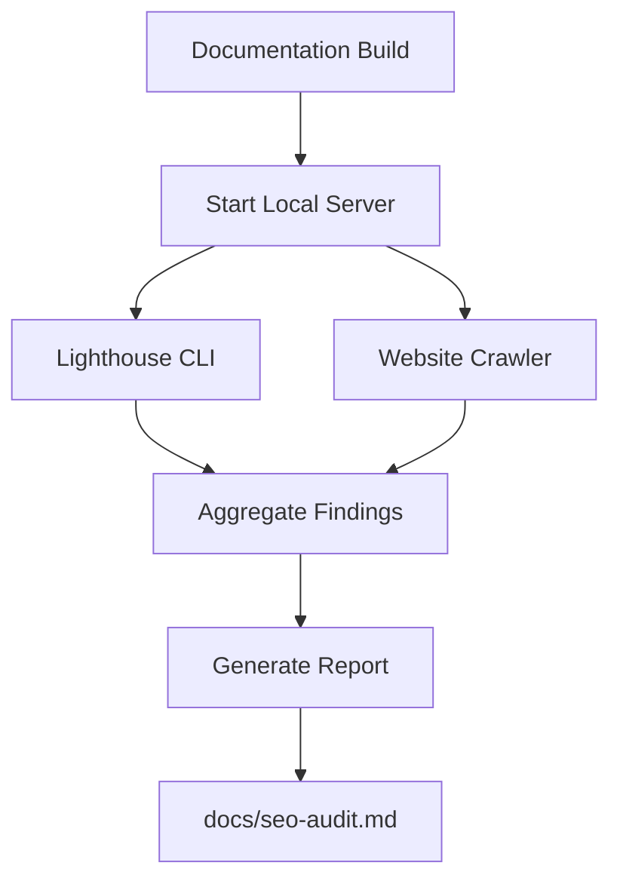

# Design Document: SEO Audit Feature

## Overview

The SEO Audit feature provides automated comprehensive SEO analysis of the documentation website. It integrates Lighthouse and a website crawler into the CI/CD pipeline to identify technical SEO issues, capture baseline metrics, and generate an actionable report written to `docs/seo-audit.md`.

**Key Goals:**
- Automate SEO audits during the build process
- Identify on-page and structural SEO issues
- Generate prioritized recommendations
- Capture baseline metrics for tracking improvements over time

## Architecture

### System Context



### Components

1. **Audit Script** (`scripts/seo-audit.js`) - Main orchestration script
2. **Lighthouse Runner** - Invokes Lighthouse CLI with SEO configuration
3. **Crawler Runner** - Invokes website crawler (Screaming Frog/ahrefs equivalent)
4. **Report Generator** - Aggregates findings and writes markdown report

### Integration Points

- **Build Pipeline**: Runs after `npm run build` completes
- **Output Location**: Writes to `docs/seo-audit.md` (or `documentation/docs/seo-audit.md`)
- **CI Failure**: Fails/warns when Critical issues detected

## Components and Interfaces

### Audit Script Interface

```typescript
interface AuditConfig {
  buildDir: string;           // Path to built documentation
  outputFile: string;         // Path for audit report
  port: number;               // Local server port
  lighthouseCategories: string[];  // performance, accessibility, best-practices, seo
  failOnCritical: boolean;    // Fail build on critical issues
}

interface AuditResult {
  timestamp: string;
  pagesAudited: number;
  lighthouseScores: {
    performance: number;
    accessibility: number;
    bestPractices: number;
    seo: number;
  };
  lighthouseIssues: SEOIssue[];
  crawlerIssues: SEOIssue[];
  summary: {
    critical: number;
    high: number;
    medium: number;
    low: number;
  };
}

interface SEOIssue {
  type: 'lighthouse' | 'crawler';
  category: string;
  title: string;
  description: string;
  location: string;  // URL or file path
  recommendation: string;
  priority: 'critical' | 'high' | 'medium' | 'low';
}
```

### CLI Tools

- **Lighthouse CLI**: `lighthouse <url> --only-categories=seo --output=json --output-path=<file>`
- **Crawler**: Using `seo-linter` or custom crawler script for static analysis

## Data Models

### Audit Report Structure

```markdown
# SEO Audit Report

**Generated:** YYYY-MM-DD HH:MM:SS

## Summary

| Metric | Value |
|--------|-------|
| Pages Audited | N |
| SEO Health Score | X/100 |
| Critical Issues | N |
| High Issues | N |
| Medium Issues | N |
| Low Issues | N |

## Lighthouse Scores

| Category | Score |
|----------|-------|
| Performance | X |
| Accessibility | X |
| Best Practices | X |
| SEO | X |

## Findings

### Critical Issues

| Issue | Location | Recommendation |
|-------|----------|----------------|
| ... | ... | ... |

### High Issues
...

### Medium Issues
...

### Low Issues
...
```

### Issue Priority Mapping

| Source | Issue Type | Default Priority |
|--------|------------|------------------|
| Lighthouse | `no-crawlable-links` | Critical |
| Lighthouse | `document-does-not-have-a-title` | Critical |
| Lighthouse | `meta-description` | High |
| Crawler | Broken links | High |
| Crawler | Missing alt text | Medium |
| Crawler | Missing canonical | Medium |
| Lighthouse | `html-has-lang` | Medium |
| Lighthouse | `link-text` | Low |

## Correctness Properties

*A property is a characteristic or behavior that should hold true across all valid executions of a system-essentially, a formal statement about what the system should do. Properties serve as the bridge between human-readable specifications and machine-verifiable correctness guarantees.*

### Property 1: Lighthouse audit produces scores

*For any* successfully built documentation site, running the SEO audit should produce Lighthouse scores for all four categories (performance, accessibility, best-practices, seo)

**Validates: Requirements 1.2, 1.3**

### Property 2: Crawler detects broken links

*For any* built documentation site with internal broken links, the crawler should identify each broken link with its location

**Validates: Requirements 2.2**

### Property 3: Crawler detects metadata issues

*For any* built documentation site, the crawler should identify missing or duplicate title tags and meta descriptions for each page

**Validates: Requirements 2.3, 2.4**

### Property 4: Report contains all required sections

*For any* generated audit report, it must include: timestamp, summary section with SEO health score, Lighthouse scores, findings categorized by priority, and recommendations with specific locations

**Validates: Requirements 3.2, 3.3, 3.4, 3.5, 4.1, 4.2, 4.3, 4.4**

### Property 5: Report ordered by priority

*For any* generated audit report, all Critical issues shall appear before High issues, all High issues before Medium, and all Medium before Low

**Validates: Requirements 5.1, 5.2, 5.3, 5.4**

### Property 6: Baseline metrics captured

*For any* generated audit report, it shall contain: Lighthouse scores (4 categories), total pages audited, count of issues by priority level, and timestamp

**Validates: Requirements 4.1, 4.2, 4.3, 4.4**

### Property 7: Audit runs against build output

*For any* audit run, the Lighthouse and crawler shall analyze files from the `build/` directory (or equivalent Docusaurus output path)

**Validates: Requirements 7.1, 7.3**

### Property 8: Critical issues fail build

*For any* audit run with failOnCritical enabled, when Critical issues are detected, the process shall exit with a non-zero status code

**Validates: Requirements 6.2**

### Property 9: Recommendations include specific locations

*For any* issue in the audit report, the location field shall contain either a file path (e.g., `docs/page.md`) or URL where the issue exists

**Validates: Requirements 5.4**

### Property 10: Image alt text detection

*For any* built documentation site, the crawler shall identify images missing alt text attributes

**Validates: Requirements 2.5**

### Property 11: Canonical URL detection

*For any* built documentation site, the crawler shall identify pages missing canonical URL declarations

**Validates: Requirements 2.6**

## Error Handling

### Failure Scenarios

| Scenario | Handling |
|----------|----------|
| Build directory missing | Exit with error: "Build directory not found. Run `npm run build` first." |
| Local server fails to start | Exit with error: "Failed to start local server on port X" |
| Lighthouse CLI not installed | Warn and skip Lighthouse audit, continue with crawler |
| Crawler fails | Log error, continue with available results |
| No pages found | Warn: "No pages found in build directory" |
| Report write fails | Exit with error: "Failed to write audit report" |

### Exit Codes

| Code | Meaning |
|------|---------|
| 0 | Success - audit completed with no critical issues |
| 1 | Success - audit completed but critical issues found (if failOnCritical=false) |
| 2 | Failure - critical error (missing build, write failure, etc.) |
| 3 | Failure - critical issues detected and failOnCritical=true |

## Testing Strategy

### Dual Testing Approach

**Unit Tests:**
- Test report generation with mock data
- Test priority sorting logic
- Test timestamp formatting
- Test issue categorization

**Property Tests:**
- Test that Lighthouse runs against any valid URL and returns scores
- Test that crawler finds broken links in any valid static site structure
- Test that report contains all required sections for any audit result
- Test that priority ordering is correct regardless of input order

### Property-Based Testing Configuration

- **Framework**: Use the appropriate PBT library for Node.js (e.g., fast-check)
- **Iterations**: Minimum 100 iterations per property
- **Tag Format**: `Feature: seo-audit, Property N: <property description>`

### Example Property Test

```typescript
// Feature: seo-audit, Property 4: Report contains all required sections
import { fc, test } from '@fast-check';

test('Report contains all required sections', () => {
  fc.assert(
    fc.property(fc.anything(), (auditResult) => {
      const report = generateReport(auditResult);
      expect(report).toContain('## Summary');
      expect(report).toContain('## Lighthouse Scores');
      expect(report).toContain('## Findings');
      expect(report).toContain('Critical Issues');
      expect(report).toContain('High Issues');
    }),
    { numRuns: 100 }
  );
});
```

### Tools to Use

- **Lighthouse CLI**: For performance and SEO auditing
- **Custom crawler script**: For static analysis (broken links, metadata, alt text)
- **fast-check**: For property-based testing in Node.js environment

### Verification

After implementation, verify by:
1. Running `npm run build`
2. Running the SEO audit script
3. Checking `docs/seo-audit.md` exists and contains all required sections
4. Running unit and property tests